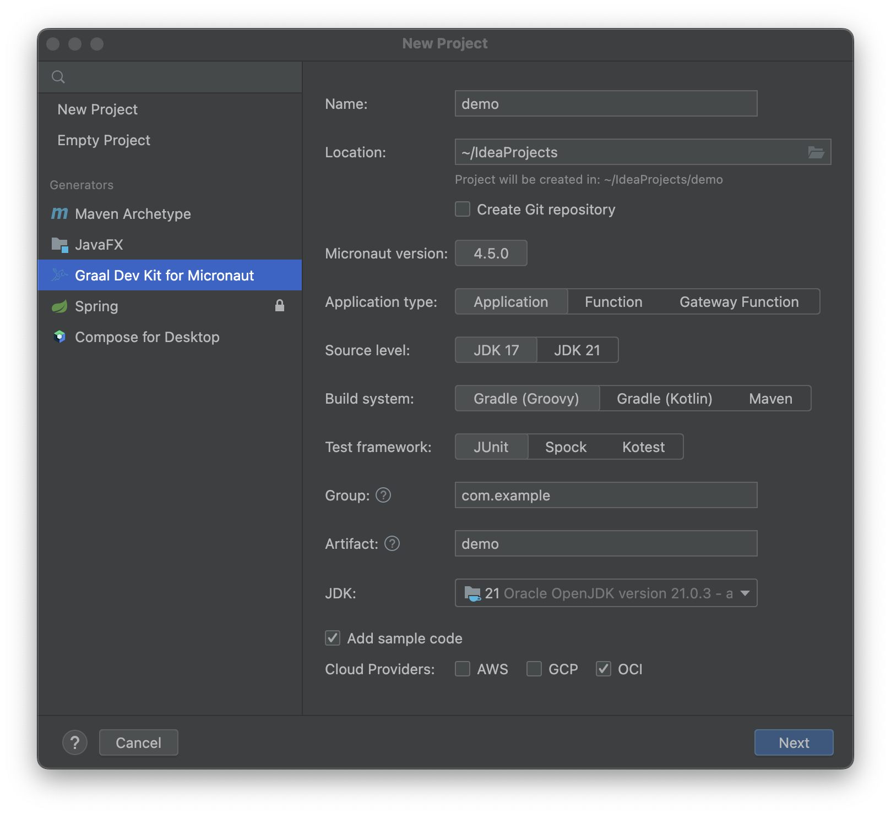

# Graal Development Kit for Micronaut

[Graal Development Kit for Micronaut](https://graal.cloud/gdk) is a cloud-agnostic development framework, built on top of
[Micronaut](https://micronaut.io/). Using Graal Development Kit for Micronaut you can write once and then run the same code on multiple cloud platforms.

This extension provides a wizard to easily create a new Graal Development Kit for Micronaut project.

## Create New Project Wizard

The wizard can generate different types of Graal Development Kit for Micronaut applications and serverless applications. You can select the Graal Development Kit for Micronaut features you want your project to include.

1. Go to **file**, **new**, **project**, find "Graal Dev Kit for Micronaut", in the project generators panel on the left.

   

2. Follow the command prompts to generate a new Maven or Gradle project. For example, to create a simple Java-based Graal Development Kit for Micronaut application:
  - Select the Micronaut version
  - Select an Application type
  - Select an installed JDK
  - Provide a name for the project
  - Provide a base package
  - Select a build tool: Maven or Gradle
  - Select a unit test framework: JUnit, Spock, or Kotest
  - Select cloud providers to support: Oracle Cloud Infrastructure and/or Amazon Web Services; Note: you need to select OCI if you want OCI DevOps support 

3. In the next wizard step pick the Graal Development Kit for Micronaut services to be included in the project

4. Finally, you are asked where to save your new project. You then choose to open it in a new Intellij window or add it to a Workspace in the current window.

You now have a new Graal Development Kit for Micronaut application, complete with example code showing you how to start using [Graal Development Kit for Micronaut](https://graal.cloud/gdk).

## Provide Feedback or Seek Help

* Request a feature
* File a bug

### Privacy Policy

Read the [Oracle Privacy Policy](https://www.oracle.com/legal/privacy/privacy-policy.html) to learn more.
